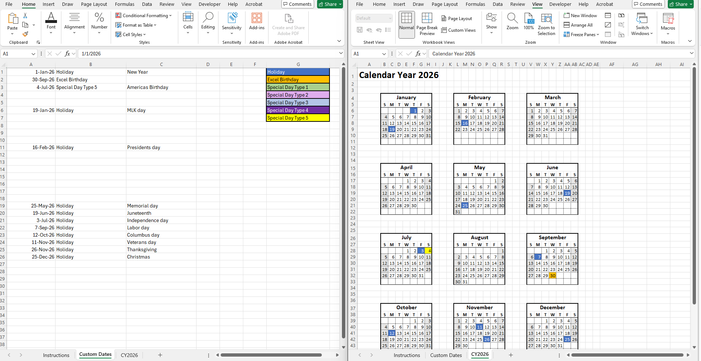

# excel-calendar-creator
A excel spreadsheet with a vba script that can create calendars based on custom dates.

How to Use the Calendar Maker 
0) Turn on the Developer tab (one-time)
Windows (Excel 2016/2019/365) 
File > Options > Customize Ribbon
In “Main Tabs,” check Developer > OK

1) One-time workbook setup 
Save the file as .xlsm (macro-enabled). 
When opening, click Enable Content if prompted so macros can run. 
Use the Generate Calendar button on the Instructions sheet
(or run via Developer > Macros > MakeCalendar > Run).

2) (Optional) Set up Custom Dates & Colors 
Create or open the sheet named Custom Dates and enter: 
Column A (Date): Enter dates like 1/1/2026 or 1-Jan-26
(Both are valid Excel dates; 1-Jan-26 avoids regional MM/DD vs DD/MM confusion.) 
Column B (Classification): The label to apply on that date (e.g., Holiday, Birthday). 
Column G (Legend index): List your classification names again (e.g., Holiday, Training, Payday, Birthday, etc.) and set each cell’s Fill Color to the color you want used on the calendar and in the legend. 
Important matching rule: the text in Column B must match a name in Column G (case-insensitive; spelling matters). 
Legend limit: the first 7 unique entries in G are used for the legend.

3) Generate a calendar
Click Generate Calendar. 
Prompt: Yes = Fiscal (Oct–Sep, labeled by end year, e.g., FY2026). 
No = Annual (Jan–Dec; creates a CY#### sheet). 
Enter the year when asked. 
Choose week start (Monday or Sunday). 
A new sheet named FY#### or CY#### is created.

4) What the output includes 
12 mini-calendars arranged 3 across × 4 down. 
Each month is a fixed 6-week grid (equal height).
There are 2 blank rows between month blocks. 
Custom dates are colored on the calendar using the fill + font from the matching entry in Custom Dates!G.
A legend under the grid (labels shown in black text for readability):
Items 1–3 from G > cells B47:D49
Items 4–6 from G > cells L47:N49
Item 7 from G > cells V47:X47
A version stamp every run:
V48: Version CAO:
V49: timestamp YYYYMMDD-HHMM (24-hour time), e.g., 20250912-1615.

5) Updating later
Edit Custom Dates (A = date, B = classification, G = legend entries/colors).
Click Generate Calendar again. The macro replaces the existing FY/CY sheet and rebuilds colors + legend.

6) Troubleshooting
Don’t see the macro?
File is .xlsm, macros enabled, and Public Sub MakeCalendar() is in a standard module (Modules > Module1).
The macro must have no parameters.
Legend missing items?
Check Custom Dates!G has entries; only the first 7 unique are used.
A date didn’t color?
Confirm the date is inside the chosen FY/CY range.
Ensure Column B text matches a Column G name (spelling matters; case doesn’t).
Button not working?
Re-assign: right-click the button > Assign Macro… > select MakeCalendar > OK.
Verify the Developer tab is enabled and macros aren’t blocked by Trust Center.

That’s it! Enter dates like 1/1/2026 or 1-Jan-26, set your legend names/colors in G, then click Generate Calendar and follow the prompts.
